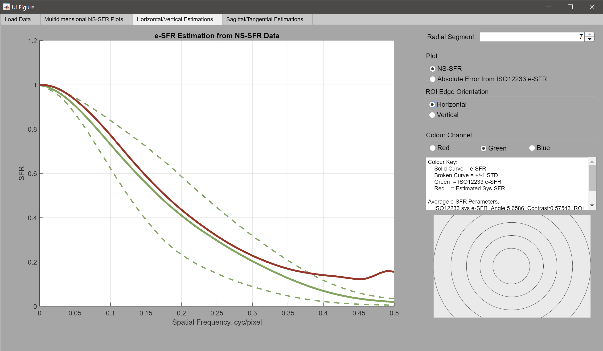
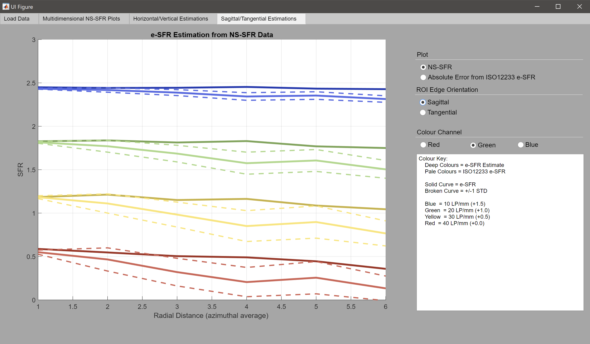

# Natural Scene Derived Spatial Frequency Response – MATLAB Code
By Oliver van Zwanenberg, Sophie Triantaphillidou, Alexandra Psarrou and Robin B. Jenkin
School of Computer Science and Engineering, The University of Westminster, UK 

## Introduction
The Natural Scene derived Spatial Frequency Response (NS-SFR) framework automatically extracts suitable step-edges from natural pictorial scenes and processes these edges via the slanted edge algorithm. This data is then used to estimate the system e-SFR (measured using the BSI ISO12233). This MATLAB code provides both parts of this proposed methodology and a MATLAB app to plot the results.

For further detail, please see:

O. van Zwanenberg, S. Triantaphillidou, R. B. Jenkin, and A. Psarrou, “Estimation of ISO12233 Edge Spatial Frequency Response from Natural Scene Derived Step-Edge Data” Journal of Imaging Science and Technology (JIST), Symposium Electronic Imaging (EI), 2022. **(Pending Publication)**

O. van Zwanenberg, S. Triantaphillidou, R. B. Jenkin, and A. Psarrou, “Analysis of Natural Scene Derived Spatial Frequency Responses for Estimating Camera ISO12233 Slanted-Edge Performance” Journal of Imaging Science and Technology (JIST), Symposium Electronic Imaging (EI), 2022. **(Pending Publication)**

O. van Zwanenberg, S. Triantaphillidou, R. B. Jenkin, and A. Psarrou, “Natural Scene Derived Camera Edge Spatial Frequency Response for Autonomous Vision Systems” IS&T/IoP London Imaging Meeting, 2021.  

O. van Zwanenberg, S. Triantaphillidou, R. B. Jenkin, and A. Psarrou, “Camera System Performance Derived from Natural Scenes” IS&T International Symposium on Electronic Imaging: Image Quality and System Performance XVII: Displaying, Processing, Hardcopy, and Applications, 2020.

O. van Zwanenberg, S. Triantaphillidou, R. B. Jenkin, and A. Psarrou, “Edge Detection Techniques for Quantifying Spatial Imaging System Performance and Image Quality”, IEEE: New Trends in Image Restoration and Enhancement (NTIRE) workshop, in conjunction with Conference on Computer Vision and Pattern Recognition (CVPR), 2019.

## Requirements
MATLAB and the following MATLAB Toolboxes:

•	Image Processing Toolbox

•	Parallel Computing Toolbox

•	Statistics and Machine Learning Toolbox

### SFRMAT4
Sfrmat4 was written by P. D. Burns and is available at [1]. Throughout the provided MATLAB code, ‘sfrmat4.m’ is used to measure the e-SFR via the slanted edge method. Minor adjustments were made to the code to output edge angle, contrast and whether clipping is present. Also, error flags are placed in the code to catch and deselect unsuitable natural scene step-edges. 

## Guide
### 1. Part 1 – The NS-SFR extraction:

Running ‘Pt1_NSSFR_Extraction.m’ isolates step edges from a dataset of images. Before running the code, ensure the image dataset is stored in a folder and that all images are taken with the same camera system, lens, and aperture. 

When initialising the code, you will first be prompted to state whether the dataset is either RAW or TIFF image format (see Figure 1). The TIFF format is a standard .tif file, whilst the RAW must be a .dng. The provided DNG image reader (imreadDNG.m) is based on reading a converted Nikon NEF RAW file [2]; therefore, the DNG image reader may need to be modified depending on the camera model used to capture the dataset.
  
 *Figure 1 – Select dataset file format*
  
After selecting a file format, you will need to select the folder that the dataset resides. Then a second directory panel will appear for you to select a folder where the result (.mat) files will be saved, a file will be generated per image, therefore it is recommended to have a dedicated results folder directory. The code will then run through processing the images and measuring the NS-SFRs.

Depending on the number of images, pixel resolution, and CPU cores available, this script may take time to run.

### 2.	Part 2 – System e-SFR Estimation:

To estimate the system e-SFR from the extracted NS-SFR data, run the ‘Pt2_ESFR_Estimation.m’ script. You will be prompted to select which e-SFR orientation you want to estimate, Horizontal & Vertical or Sagittal & Tangential, or both orientation groups (see Figure 2).  Note, the NS-SFRs are extracted in the Horizontal & Vertical orientation, thus, the conversion to Sagittal & Tangential will extend the computation time. 

 *Figure 2 – Select which orientations to estimate*

Select the directory containing the .mat files from ‘Pt1_NSSFR_Extraction.m’. 

Depending on the orientation chosen, you will be asked to load ISO12233 Test chart data for the chosen orientations (see Figures 3 and 4). If ‘Yes’, choose the appropriately laid out .mat file; see Section 4 of this guide.

 *Figure 3 – Use Horizontal & Vertical test chart data?*
 *Figure 4 – Use Sagittal & Tangential test chart data?*

The script will run and save a file named ‘eSFR_Estimation.mat’ into the selected results directory. 

### 3.	Plotting the Results: 

A MATLAB app user interface is provided to assist with visualising the data. To install the app in MATLAB, go to the App Tab in the top left, click Install App, and select ‘Plot_NSSFR_Data.mlappinstall’. The app ‘Plot NSSFR Data’ should now be in your Apps dropdown. 

Starting the app, a user interface Figure will open (see Figure 5). Next, click the load button and select the ‘eSFR_Estimation.mat’ file, the text under the button will inform you once loaded. A popup window will open when loading the data to ask for the camera’s pixel pitch (see Figure 6), only required for Sagittal & Tangential plots.

 *Figure 5 – Load Tab of user interface*
 *Figure 6 – Insert the camera pixel pitch*

The three tabs in the user interface (see Figure 7-9) provide the plots of:

1)	the NS-SFRs binned to a multidimensional coordinate system, visualising the variation in the data,
2)	the Horizontal & Vertical estimates,
3)	and the Sagittal & Tangential estimates. 

In each tab, parameters can be adjusted, including the radial segment of the frame, the colour channel (if from RAW images), orientation and spatial frequency. In addition, if there is ISO12233 test chart data, the absolute estimation error can be displayed.

 *Figure 7 – Multidimensional NS-SFR Plotting Tab*

 *Figure 8 – Horizontal & Vertical Plotting Tab*

 *Figure 9 – Sagittal & Tangential Plotting Tab*

### 4.	Measuring the ISO12233 Test Chart e-SFR:

If test chart e-SFR data is used, the data must be correctly stored in a cell array. To achieve this, ‘ManualROISelection.m’ is provided. Running this script will open a user interface to select step-edge from test chart images. First, store the test chart captures in a folder and select the directory when prompted. After the script loads the images from that directory, it will display the first image. Next, move the red selector to each chart Horizontal/Sagittal edges and click ‘Select’. Once all Horizontal/Sagittal edges are selected from the displayed image, click ‘Next’. If multiple test chart images are in the directory, the user interface will display the next image to repeat the Horizontal/Sagittal edge selection. After the Horizontal/Sagittal edges are selected from the images, the user interface will display the first image for you to repeat the selection process, but for the Vertical/Tangential edges. 

Clicking ‘Finish’ will close the user interface and will ask you to save the data. The e-SFRs are measured using sfrmat4 and are stored ready for Part 2 estimation.

The test chart should fill the frame, obtaining many e-SFRs across the field of view. Failing this, multiple captures of the test chart can be used, moving it across the field of view. Many step edges across each radial segment will provide a more accurate standard deviation measurement to assess the e-SFR estimate.

## Image Datasets from our Publications:
The three datasets used in our publications
***Link coming soon***

## Citation: 
If you use this method in your research, please cite:
O. van Zwanenberg, S. Triantaphillidou, R. B. Jenkin, and A. Psarrou, “Estimation of ISO12233 Edge Spatial Frequency Response from Natural Scene Derived Step-Edge Data” Journal of Imaging Science and Technology (JIST), Symposium Electronic Imaging (EI), 2022. **(Pending Publication)**

## License:

**Copyright (c) 2021, Oliver van Zwanenberg**

All rights reserved.

## References: 

[1] 	P. D. Burns, “sfrmat4 source code,” Burns Digital Imaging, 2020. Available: http://burnsdigitalimaging.com/software/sfrmat/ [Accessed 04 October 2020].

[2] 	Steve Eddins, “Tips for reading a camera raw file into MATLAB”, Online, 2011. Available: https://blogs.mathworks.com/steve/2011/03/08/tips-for-reading-a-camera-raw-file-into-matlab/, [Accessed 08 September 2021].
